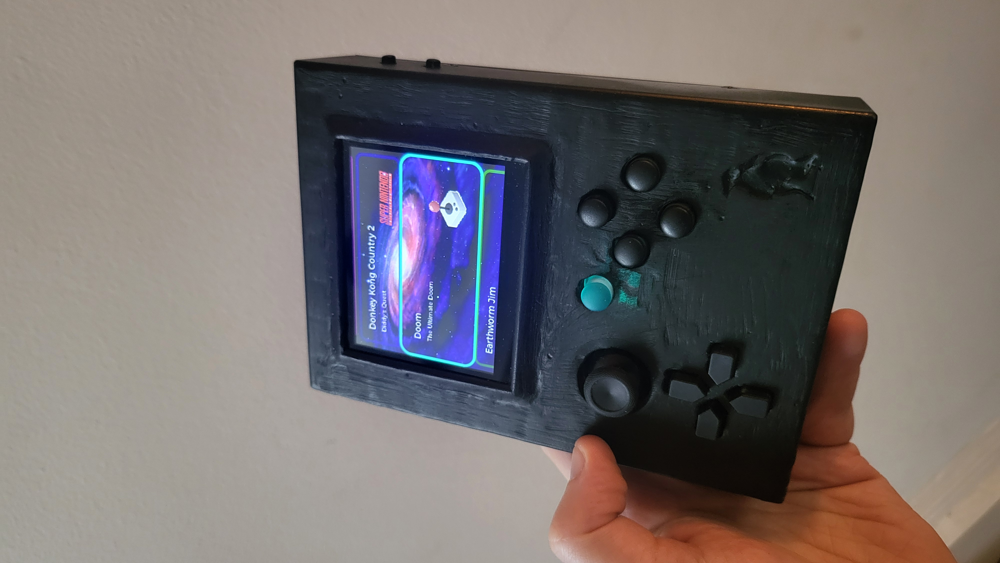
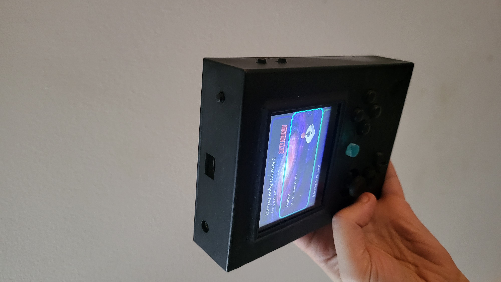

# gk and gkos #

This respository provides PCB schematics, firmware and debugging support for the gk handheld game console and its operating system, gkos.

## Overview ##

gk is a small, battery powered handheld gaming console running on an MCU (STM32H7S7) running at 600 MHz coupled to 128 MiB of XPSI SDRAM.  It has a 640x480 pixel 24-bit colour touchscreen, audio output (headphones/builtin speaker), accelerometer/gyrometer for tilt detection, USB interface for provisioning and WiFi network support.

The KiCAD schematics and case STL files are available in the gk-pcbv3 directory.

The firmware (gkos) is available in the Firmware directory and further documented in Firmware/doc

Despite being just a microcontroller, gk is able to run many native games at more-than-acceptable framerates including a PacMan clone (https://github.com/ebuc99/pacman), sdl2-doom (https://github.com/AlexOberhofer/sdl2-doom), QuakeGeneric (https://github.com/erysdren/quakegeneric), ChocolateDescent (https://github.com/InsanityBringer/ChocolateDescent), Red Alert SDL (https://github.com/Daft-Freak/CnC_and_Red_Alert/tree/main) as well as playable versions of Mesa software-rendered 3D games including Tux Racer (https://tuxracer.sourceforge.net/).  It also supports emulation - Mednafen (https://mednafen.github.io/) Atari Lynx, GameBoy, NES and Sega Master System and SNES modules all run at >= 20 frames per second (simpler ones at 60).  The Hatari emulator (https://hatari.tuxfamily.org/) is also supported.

Other relevant repositories include the gkos userspace toolchain and libraries (https://github.com/jncronin/gk-userland) which also contains the "gk-menu" process which displays a list of games, and the userland interface (https://github.com/jncronin/gk-userlandinterface) which contains simple defines/structures that are used to communicate between the userland and the kernel.

## Examples ##

