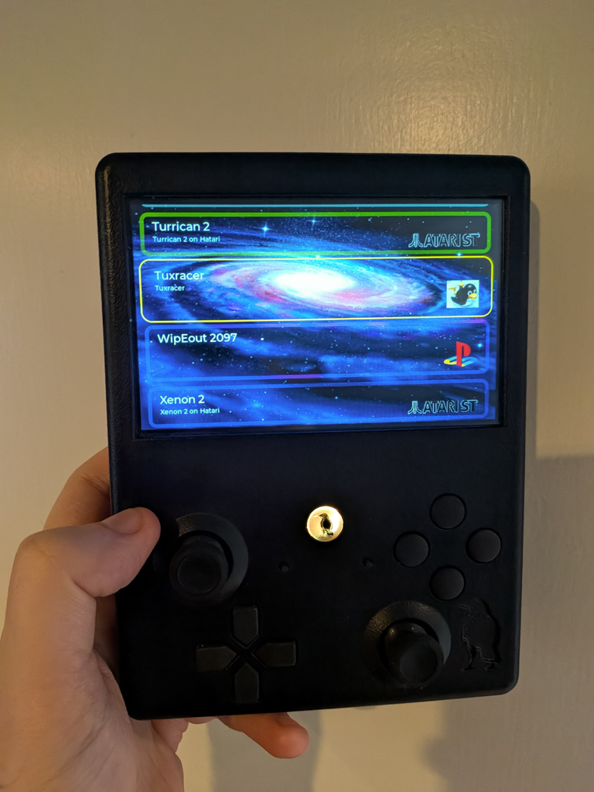
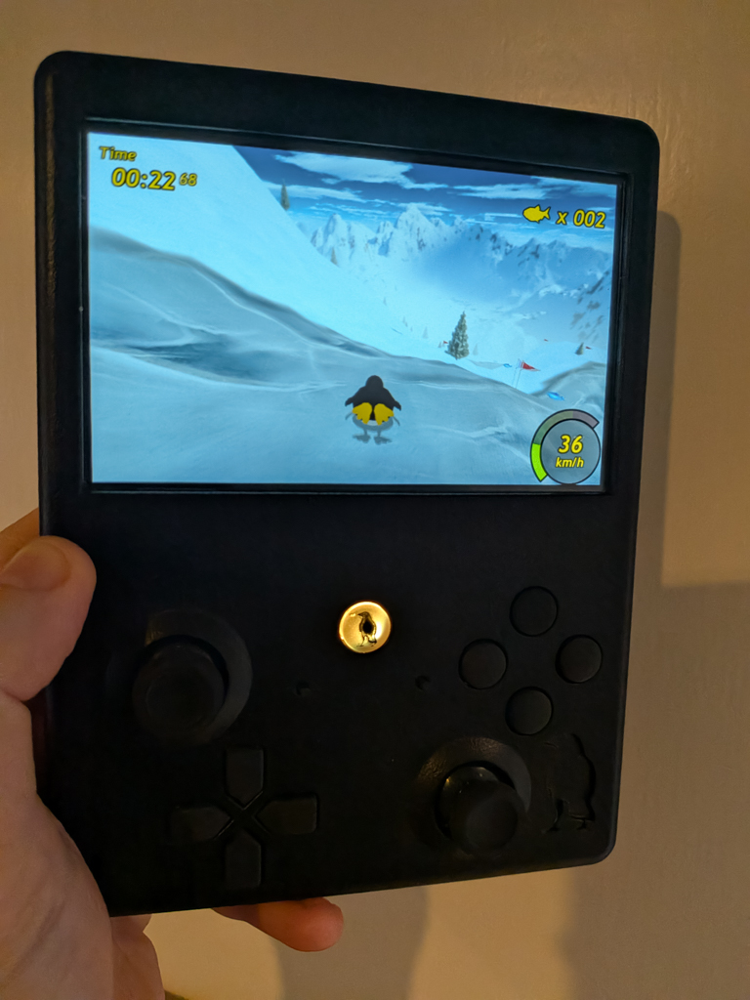
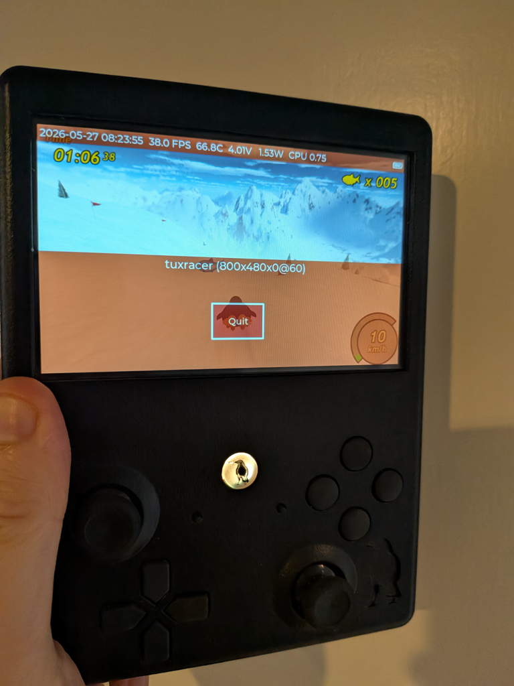

# gk and gkos #

This respository provides PCB schematics, firmware and debugging support for the gkv4 handheld game console and its operating system, gkos.  For the original STM32H7S7-based gk, see [README-v3.md](README-v3.md).

gkv4 represents a significant upgrade over the original gk with improved speed, a bigger screen, more gamepad buttons and hardware-accelerated 3D rendering.

## Overview ##

gkv4 is a small, battery powered handheld gaming console running on a STM32MP2 MPU (dual Cortex-A35 cores with additional Cortex-M33 core).  It runs a custom OS called gkos which allows near-instantaneous (MCU-like) cold boot times but is powerful enough to run most POSIX userspace applications.  See <https://github.com/jncronin/gk-userland> for the userland support including cross GCC toolchains and useful libraries.

Game/emulator support:
- Mednafen for NES, SNES, SMS, MD and Lynx support
- Hatari for Atari ST
- PCSX_rearmed for PS1
- Mupen64plus (see fork at <https://github.com/jncronin/mupen64-combined>) for N64 (GPU-accelerated)
- Atari++ for Atari XL
- DOSBox-X (achieves 25000 cycles/second, 199561 parrots, 74 XT on speedtst.com, roughly 486 50 MHz equivalent)
- Native ports of:
    - Neverball/neverputt (GPU-accelerated with tilt support)
    - Tuxracer (GPU-accelerated)
    - Doom (sdl2-doom)
    - Quake (ChocolateQuake)
    - Descent (ChocolateDescent)
    - koules

## Hardware Specifications ##

PCBs, schematics and case STL files are available in <https://github.com/jncronin/gk/tree/main/gk-pcbv4>.

- STM32MP255D processor with variable clock rate (defined on a per-game basis).  Debug and trace ports exposed.
- LPDDR4 RAM (1 GiB in current version)
- Lithium ion battery (10,000 mAH in current version) with USB-C charging via BQ25601, state of charge monitoring via MAX17048 and current sensing via INA236
- 800x480 5 inch touchscreen (ER-TFT050-6).  Hardware scaling support via STM32MP2 LTDC peripheral.
- Micro SD for storage with voltage switch support
- Wifi/Bluetooth module attached via M.2 E-key interface (e.g. EAR00389 module)
- Gyrometer/accelerometer + optional magnetometer for tilt interface
- Headphone + internal speaker audio out via TAD5112
- Multiple controls including:
    - Left and right analog sticks (programmable as digital on per-game basis)
    - ABXY + DPAD buttons
    - Start + select buttons
    - Analog throttle controller
    - Volume up/down (can be programmed as additional game inputs)
    - Menu button (opens OSD)
    - Left/right trigger + bumper buttons on back of device
- Battery backup for RTC

Total current draw is heavily dependent on screen brightness but is typically 1.5W or less at full CPU + GPU load with medium brightness, and max ~2W at full brightness.

## Software ##

gkos is a custom OS written from scratch in C++.  It is available in the <https://github.com/jncronin/gk/tree/main/Firmware-v4> directory.  Features:

- Armv8-A SMP scheduler with multiple active processes + threads
- Syscall interface with wrappers for most POSIX functions
- High resolution (10 ns precision) timer provided to games
- pthread support including threads, mutexes, semaphores, conditions, rwlocks and barriers
- A port of the etnaviv GPU driver allowing hardware-accelerated OpenGL
- Driver for Infineon CYW43439 chipset and IPv4 network stack
- SD card (with UHS-I mode support) with Ext4 (Lwext4) and FAT (fatfs) drivers
- USB driver allowing the device to present itself as a mass storage device to allow provisioning the internal SD card
- Offloading of all input tasks, including tilt sensor and touch screen filtering, to Cortex-M33 core

## Examples

Tuxracer using the GPU for rendering:

Tuxracer with the OSD overlay (handled by the gk-supervisor process in the (https://github.com/jncronin/gk-userland) repo) showing current system health, battery and cpu usage:

